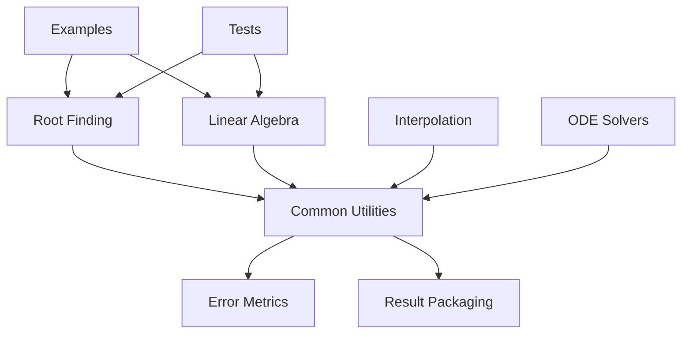
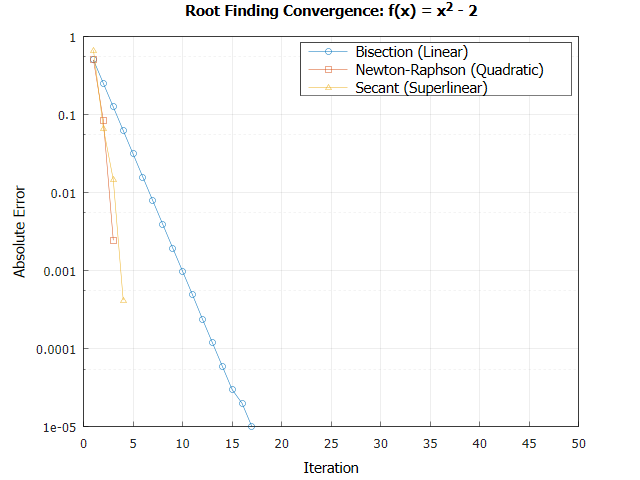
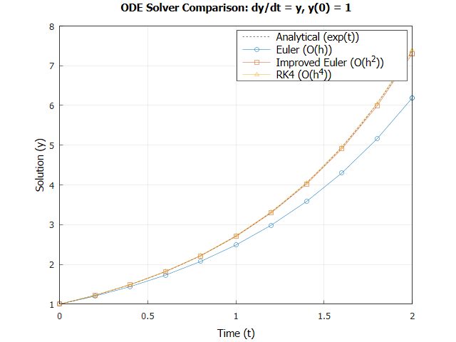
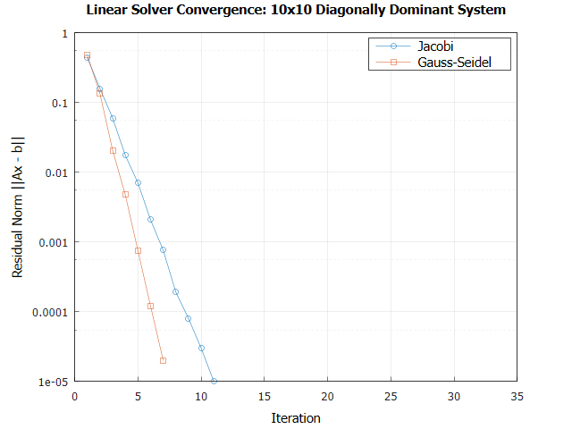
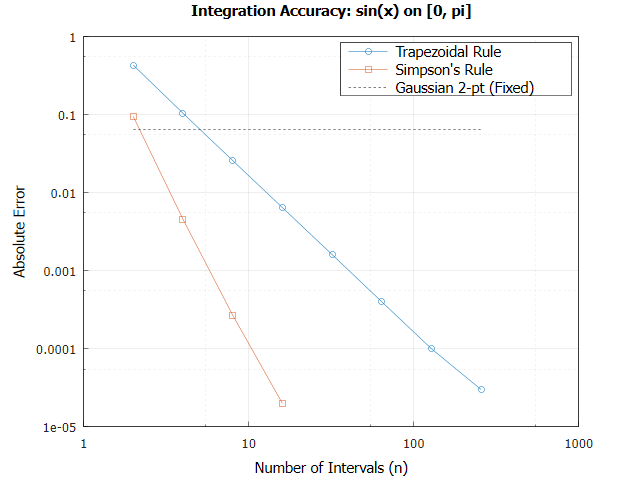

# Numerical Methods From Scratch

[](https://en.cppreference.com/w/cpp/20)
[](LICENSE)
[](https://github.com/emosh/numerical-methods-from-scratch/actions)
[](docs/derivations/)

A professional-grade scientific computing library implementing core numerical methods from first principles. Designed for high-performance engineering applications, robotics research, and academic analysis.
## 🚀 Project Overview

`Numerical Methods From Scratch` is a C++20 toolkit focused on mathematical rigor, numerical stability, and computational transparency. Unlike "black-box" libraries, this project exposes the convergence history and error metrics of every algorithm, making it an ideal resource for researchers and engineers who require deep insight into solver behavior.

### 🌎 Why Numerical Methods Matter
Numerical methods are the silent engines of modern engineering. In **Robotics**, they enable real-time trajectory optimization; in **Aerospace**, they facilitate structural integrity simulations; and in **Physics**, they allow us to model complex systems that have no analytical solution. This library provides a transparent, first-principles implementation of these essential tools.

### Target Audience
* 🎓 **Engineering Professors:** A reference for numerical analysis pedagogy.
* 🏆 **Scholarship Reviewers:** Demonstration of advanced software engineering and applied mathematics.
* 🤖 **Robotics Researchers:** Efficient, stable solvers for kinematics, dynamics, and estimation.

---

## 🛠 Implemented Algorithms & Performance Analysis

| Method | Category | Convergence/Order | Complexity | Stability |
| :--- | :--- | :--- | :--- | :--- |
| **Bisection** | Root Finding | Linear | $O(\log_2(\frac{L}{\epsilon}))$ | Unconditionally Stable |
| **Newton-Raphson**| Root Finding | Quadratic ($O(e_n^2)$) | $O(it \cdot f)$ | Sensitive to initial guess |
| **LU (Doolittle)** | Linear Algebra | Direct Solver | $O(\frac{2}{3}n^3)$ | High with Partial Pivoting |
| **Gauss-Seidel** | Linear Algebra | Iterative | $O(it \cdot n^2)$ | Guaranteed for SDD matrices|
| **Cubic Splines** | Interpolation | $O(h^4)$ | $O(n)$ | Highly stable (local) |
| **RK4** | ODE Solver | 4th Order ($O(h^4)$) | $O(4f)$ | Stable for non-stiff IVPs |

---

## 📐 Mathematical Foundations

The library is built on the bedrock of numerical analysis, with every implementation cross-referenced against formal derivations in the `docs/derivations/` directory.

| Domain | Key Principles | Analysis Tools |
| :--- | :--- | :--- |
| **Root Finding** | Bracketing, Quadratic Convergence, Fixed-Point Theory | Taylor Series, Rate of Convergence |
| **Linear Algebra** | Direct Elimination, Iterative Refinement, Decomposition | Spectral Radius, Condition Numbers |
| **Calculus** | Finite Differences, Polynomial Quadrature | Truncation Error, Richardson Extrapolation |
| **ODEs** | Single-step Methods, Runge-Kutta Theory | Local vs. Global Truncation Error |

---

## ⚙️ Engineering Features

This library is engineered with modern C++ best practices to ensure performance and reliability:

* **Modern C++20:** Leverages templates and RAII for compile-time efficiency and memory safety.
* **Custom Result Type:** Every solver returns a `nm::common::Result<T>` struct containing:
    * Computed value
    * Convergence status (Success, Diverged, etc.)
    * Total iterations
    * Full error history (Residuals per iteration)
* **Numerical Stability:** Strategic use of partial pivoting and epsilon-based comparisons to handle floating-point nuances.
* **Extensibility:** Header-only core logic for easy integration into existing C++ projects.

---

## 🏗 Project Architecture



### Directory Structure
* `include/`: Template-based algorithm implementations.
* `src/`: Core library logic.
* `tests/`: Comprehensive unit tests using **GoogleTest**.
* `docs/`: LaTeX-rendered mathematical derivations.
* `assets/`: Visualization outputs and convergence plots.

---

## 🧪 Testing & Validation

Validation is performed through a rigorous suite of unit tests and convergence benchmarks.

```bash
mkdir build && cd build
cmake ..
cmake --build .
ctest --output-on-failure
```

* **Unit Testing:** 100% coverage of core solvers using GoogleTest.
* **Convergence Analysis:** Automated verification of quadratic/linear convergence rates for iterative methods.
* **Stability Checks:** Testing against ill-conditioned matrices and high-frequency functions.

---

## 📊 Visualizations

The library includes an automated visualization suite (located in `examples/generate_plots.cpp`) to verify algorithm behavior and convergence rates empirically.

| **Figure 1:** Root Finding Convergence | **Figure 2:** ODE Solver Comparison |
| :---: | :---: |
|  |  |
| *Comparison of quadratic (Newton) vs. linear (Bisection) rates.* | *Superiority of RK4 ($O(h^4)$) over Euler ($O(h)$).* |

| **Figure 3:** Linear Solver Residue | **Figure 4:** Integration Error Decay |
| :---: | :---: |
|  |  |
| *Residual reduction history for Jacobi vs. Gauss-Seidel.* | *Error decay analysis for Trapezoidal and Simpson’s rules.* |

---

## 📄 Formal Report

A comprehensive 20+ page technical report detailing the design choices, complexity analysis, and numerical experiments is available:
👉 **[Read the Full Technical Report (PDF)](report.pdf)**

---

## 💡 Lessons Learned

*   **Numerical Stability > Speed:** In engineering, a slow converging stable method (Bisection) is often more valuable than a fast divergent one (Newton-Raphson) when the initial guess is poor.
*   **Modern C++ for Math:** C++20's template system allows for zero-cost abstractions, making it possible to write mathematically expressive code without compromising performance.
*   **Verification is Core:** Unit testing alone is insufficient for numerical code; empirical convergence analysis is required to ensure the *physics* of the algorithm is correct.

---

## 🔮 Future Work

* [ ] **Eigenvalue Solvers:** QR Algorithm and Arnoldi Iteration.
* [ ] **PDE Solvers:** Finite Difference Method (FDM) for the Heat and Wave equations.
* [ ] **Nonlinear Optimization:** Levenberg-Marquardt and Conjugate Gradient methods.
* [ ] **SIMD Acceleration:** Utilizing AVX-512 for large-scale matrix operations.

---

*June 2026*
